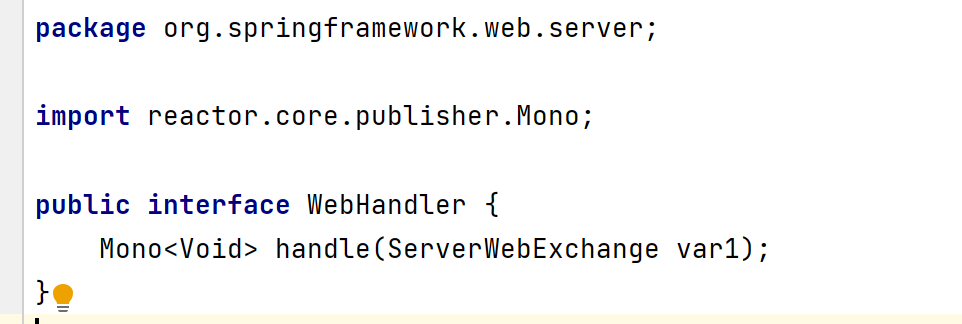

### 写在前面

[视频]:https://www.bilibili.com/video/BV1Vf4y127N5

这是一篇视频笔记，针对自我实际情况，增加了部分扩展，webFlux部分不太懂，后续细究。

笔记涉及代码完整版见[springdemo]()   及 [springWebFluxDemo]()

### Spring 5 框架

#### Spring的概念

**1.Spring框架概述**

Spring是轻量级的开源的JavaEE框架

Spring可以解决企业应用开发的复杂性

Spring有两个核心部分：IOC 和 AOP

（1）IOC：控制反转，把创建对象过程交给Spring进行管理

（2）AOP：面向切面，不修改源代码进行功能增强

Spring特点

（1）方便解耦，简化开发

（2）AOP编程支持

（3）方便程序测试

（4）方便和其他框架整合

（5）方便进行事务操作

（6）降低API开发难度

**2.入门案例**


1.新建Maven工程，导入IOC基本包


```xml
 <dependencies>
        <dependency>
            <groupId>org.springframework</groupId>
            <artifactId>spring-beans</artifactId>
            <version>5.2.2.RELEASE</version>
        </dependency>
        <dependency>
            <groupId>org.springframework</groupId>
            <artifactId>spring-core</artifactId>
            <version>5.2.2.RELEASE</version>
        </dependency>
        <dependency>
            <groupId>org.springframework</groupId>
            <artifactId>spring-context</artifactId>
            <version>5.2.2.RELEASE</version>
        </dependency>
        <dependency>
            <groupId>org.springframework</groupId>
            <artifactId>spring-expression</artifactId>
            <version>5.2.2.RELEASE</version>
        </dependency>
        <dependency>
            <groupId>commons-logging</groupId>
            <artifactId>commons-logging</artifactId>
            <version>1.2</version>
        </dependency>
     <!--junit 测试用到的依赖-->
        <dependency>
            <groupId>junit</groupId>
            <artifactId>junit</artifactId>
            <version>4.12</version>
            <scope>test</scope>
        </dependency>
    </dependencies>
```


2.创建bean类

```java
package org.example.spring.entity;

public class User {
    public void add(){
        System.out.println(111);
    }
}
```

3.编写bean.xml，实现Spring容器托管

```java
<?xml version="1.0" encoding="UTF-8"?>
<beans xmlns="http://www.springframework.org/schema/beans"
       xmlns:xsi="http://www.w3.org/2001/XMLSchema-instance"
       xmlns:context="http://www.springframework.org/schema/context"
       xsi:schemaLocation="
   http://www.springframework.org/schema/beans
   http://www.springframework.org/schema/beans/spring-beans-3.0.xsd
   http://www.springframework.org/schema/context
   http://www.springframework.org/schema/context/spring-context-3.0.xsd">
<!--配置User对象创建-->
<bean id="user" class="org.example.spring.entity.User"></bean>


</beans>
```

4.编写测试类，验证容器自动创建bean对象

```java
package org.example.spring;

import org.example.spring.entity.User;
import org.junit.Test;
import org.springframework.context.ApplicationContext;
import org.springframework.context.support.ClassPathXmlApplicationContext;

public class test {
    @Test  //这个注解用到Junit依赖包
    public void testAdd(){
        //1.加载配置文件
        ApplicationContext context = new ClassPathXmlApplicationContext("classpath:bean.xml");
        //2.获取配置创建的对象
        User user = context.getBean("user", User.class);
        System.out.println(user);
        user.add();

    }
}
```

#### IOC容器

**IOC底层原理**

**1.什么是IOC？**

（1）控制反转，把对象创建和对象之间的调用过程，交给Spring管理

（2）使用IOC目的：为了降低耦合度

2.底层原理

xml解析、工厂模式、反射

**2.IOC接口（BeanFactory）**

IOC思想是基于IOC容器完成，IOC容器底层就是对象工厂

Spring提供IOC容器的两种方式：（两个接口）

（1）BeanFactory：IOC容器基本实现，是Spring内部的私用接口，不提供开发人员使用

*加载配置文件时候不会创建对象，在获取对象（使用）才去创建对象*

（2）ApplicationContext：BeanFactory接口的子接口，提供更多更强大的功能，一般由开发人员进行使用

*加载配置文件时会把在配置文件的对象进行创建*

​		

FileSystemXmlApplicationContext：（磁盘）文件全路径

ClassPathXmlApplicationContext：类路径


**Bean管理**

Bean管理指的是两个操作：

- Spring创建对象
- Spring注入属性

Bean管理操作有两种方式

- 基于xml
- 基于注解

**IOC操作Bean管理（基于xml）**

1.基于xml创建对象

```xml
<!--配置User对象创建-->
<bean id="user" class="org.example.spring.entity.User"></bean>
```

- 在Spring配置文件中，使用bean标签，标签里面添加对应属性，就可以实现对象创建。
- 在bean标签有很多属性，常见属性
  - **id属性：唯一标识**
  - **class属性：类全路径（包类路径）**
  - name属性：与id相比，可以加”/“，struts用的比较多
- 创建对象时，默认执行无参构造方法

2.基于xml注入属性

（1）DI：依赖注入，就是注入属性

注入方式：

- 使用set方式注入

  ①创建类、定义属性，及对应的set方法

  ```java
  package org.example.spring.entity;
  public class Book {
      private String bookname;
  
      //set注入
      public void setBookname(String bookname) {
          this.bookname = bookname;
      }
      public String getBookname() {
          return bookname;
      }
  
  }
  ```

  ②Spring配置文件配置对象

  ```xml
     <!--set方式注入属性-->
      <bean id="book" class="org.example.spring.entity.Book">
          <!--
          name : 类中的属性名
          value :属性注入的值
          -->
          <property name="bookname" value="Sping入门到精通"></property>
      </bean>
  ```

  

- 有参构造注入

  ①创建类、定义属性，及有参构造

  ```java
  package org.example.spring.entity;
  
  public class Book {
      private String bookname;
  
      //有参构造注入=======================
      public Book(String bookname) {
          this.bookname = bookname;
      }
      //有参构造注入=======================
  }
  ```

  ②Spring配置文件配置对象

  ```java
  <!--有参构造-->
  <bean id="book2" class="org.example.spring.entity.Book">    //注意这里是book2
      <constructor-arg name="bookname" value="Java入门到精通"></constructor-arg>
  </bean>
  ```

**注意：**如果使用了set注入对象book（bean 的id属性），又用有参构造注入book，会报错:

```shell
org.springframework.beans.factory.parsing.BeanDefinitionParsingException: Configuration problem: Bean name 'book' is already used in this <beans> element
Offending resource: class path resource [bean.xml]
```

P名称空间注入（了解）：简化基于xml的注入

①bean.xml增加p名称空间

```xml
<beans xmlns="http://www.springframework.org/schema/beans"
       xmlns:xsi="http://www.w3.org/2001/XMLSchema-instance"
       xmlns:p="http://www.springframework.org/schema/p"  //增加P名称空间
       xmlns:context="http://www.springframework.org/schema/context"
       xsi:schemaLocation="
	http://www.springframework.org/schema/beans
	http://www.springframework.org/schema/beans/spring-beans-3.0.xsd
	http://www.springframework.org/schema/context
	http://www.springframework.org/schema/context/spring-context-3.0.xsd">
```

②p名称空间注入

```java
<!--p空间注入-->
<bean id="book3" class="org.example.spring.entity.Book" p:bookname="Spring核心">
</bean>
```

(2)xml注入其他类型属性

1. 字面值

   - null值

   ```xml
    <property name="bookname" ><null/></property>
   ```

   - 属性值包含特殊符号

   ```xml
   <!--属性值包含特殊符号
           1.<>进行转义 &lt;&gt;
           2.把带特殊符号内容写道CDATA
      -->
   <property name="bookname" >
       <value><![CDATA[<<Java核心卷1>>]]></value>
   </property>
   ```

2. 注入属性-外部bean

   （1）创建两个类service类和dao类

   （2）在service调用dao里面的方法

   ```xml
   bean.xml
   <!--service 和 dao 对象 创建-->
       <bean id="userService" class="org.example.spring.service.UserService">
           <!--注入bean对象-->
           <property name="userDao" ref="userDao"></property>
       </bean>
   
       <bean id="userDao" class="org.example.spring.dao.impl.UserDao"></bean>
   ```

   ```java
   UserService.java
   package org.example.spring.service;
   
   import org.example.spring.dao.IUserDao;
   
   public class UserService {
       private IUserDao userDao;
       public void add(){
           userDao.add();
           System.out.println("service add ....");
       }
   
       public void setUserDao(IUserDao userDao) {
           this.userDao = userDao;
       }
   
   
   }
   
   
   IUserDao.java
   package org.example.spring.dao;
   
   public interface IUserDao {
       public void add();
   }
   
   UserDao.java
   package org.example.spring.dao.impl;
   
   import org.example.spring.dao.IUserDao;
   
   public class UserDao implements IUserDao {
   
       @Override
       public void add() {
           System.out.println("UserDao add 666");
       }
   }
       
   ```

   ```java
   @Test
   public void testSD(){
       //1.加载配置文件
       ApplicationContext context = new ClassPathXmlApplicationContext("bean2.xml");
       //2.获取配置创建的对象
       UserService userService = context.getBean("userService", UserService.class);
       userService.add();
   }
   ```

3. 注入属性-内部bean和级联赋值

   (1)一对多关系：部门和员工

   ```xml
     <!--内部bean创建-->
       <bean id="emp" class="org.example.spring.entity.Employee">
           <property name="name" value="Lucy"></property>
           <property name="gender" value="female"></property>
           <!--注入bean对象-->
           <property name="department">
               <bean name="department" class="org.example.spring.entity.Department">
                   <property name="deptName" value="IT" ></property>
               </bean>
           </property>
       </bean>
   
   ```

   ```java
   Employee.java
   package org.example.spring.entity;
   
   public class Employee {
       private String name;
       private String gender;
       private Department department ;
   
       public void setName(String name) {
           this.name = name;
       }
   
       public void setGender(String gender) {
           this.gender = gender;
       }
   
       public void setDepartment(Department department) {
           this.department = department;
       }
   
       @Override
       public String toString() {
           return "Employee{" +
                   "name='" + name + '\'' +
                   ", gender='" + gender + '\'' +
                   ", department=" + department.toString() +
                   '}';
       }
   }
   
   Department.java
   package org.example.spring.entity;
   public class Department {
       private String deptName;
   
       public void setDeptName(String deptName) {
           this.deptName = deptName;
       }
   
       @Override
       public String toString() {
           return "Department{" +
                   "deptName='" + deptName + '\'' +
                   '}';
       }
   }
   
   ```

   ```java
     @Test
   public void testInner(){
       //1.加载配置文件
       ApplicationContext context = new ClassPathXmlApplicationContext("bean3.xml");
       //2.获取配置创建的对象
       Employee emp = context.getBean("emp", Employee.class);
       System.out.println(emp.toString());
   }
   ```

   (2)级联赋值

   方法1：

   ```xml
   bean4.xml
     <!--级联赋值-->
       <bean id="emp" class="org.example.spring.entity.Employee">
           <property name="name" value="Lucy"></property>
           <property name="gender" value="female"></property>
           <property name="department" ref="department" ></property>
       </bean>
       <bean name="department" class="org.example.spring.entity.Department">
           <property name="deptName" value="QA"></property>
       </bean>
   ```

   方法2：

   ```xml
     <!--级联赋值-->
       <bean id="emp" class="org.example.spring.entity.Employee">
           <property name="name" value="Lucy"></property>
           <property name="gender" value="female"></property>
           <property name="department" ref="department" ></property>
           <property name="department.deptName" value="Manager"></property>
       </bean>
       <bean name="department" class="org.example.spring.entity.Department">
       </bean>
   ```

   ```java
   public Department getDepartment() {
       return department;
   }
   ```

4. 注入属性-集合属性

   （1）创建类、定义数组、list、map、set，生成set方法

   ```java
   public class Student {
       private String[] courses;
       private List<String> list ;
       private Map<String,String> maps;
       private Set<String> sets;
       
       public void setCourses(String[] courses) {
           this.courses = courses;
       }
   
       public void setList(List<String> list) {
           this.list = list;
       }
   
       public void setMaps(Map<String, String> maps) {
           this.maps = maps;
       }
   
       public void setSets(Set<String> sets) {
           this.sets = sets;
       }
        @Override
       public String toString() {
           return "Employee{" +
                   "name='" + name + '\'' +
                   ", gender='" + gender + '\'' +
                   ", department=" + department.toString() +
                   '}';
       }
   }
   
   ```

   （2）配置文件配置

   ```xml
    <!--集合类型属性注入-->
       <bean name="student" class="org.example.spring.entity.Student">
           <property name="courses">
               <array>
                   <value>java</value>
                   <value>mysql</value>
               </array>
           </property>
           <property name="list">
               <list>
                   <value>张山</value>
                   <value>李四</value>
               </list>
           </property>
           <property name="maps">
               <map>
                   <entry key="Java" value="java"></entry>
                   <entry key="MySQL" value="mysql"></entry>
               </map>
           </property>
           <property name="sets">
               <set>
                   <value>oracle</value>
                   <value>redis</value>
               </set>
           </property>
       </bean>
   ```

   5.在集合里面设置对象类型值

   ```xml
   <bean id="course1" class="org.example.spring.entity.Course">
       <property name="cname" value="测试从入门到精通"></property>
   </bean>
   <bean id="course2" class="org.example.spring.entity.Course">
       <property name="cname" value="计算机网络"></property>
   </bean>
   <bean id="student" class="org.example.spring.entity.Student">
       <property name="courseList">
          <list>
              <ref bean="course1"></ref>
              <ref bean="course2"></ref>
          </list>
       </property>
   </bean>
   ```

   ```java
    @Test
       public void testCoursesList(){
           //1.加载配置文件
           ApplicationContext context = new ClassPathXmlApplicationContext("bean6.xml");
           //2.获取配置创建的对象
           Student stu = context.getBean("student", Student.class);
           System.out.println(stu.toString());
       }
   ```

   

   ```java
   ==Student.java
   package org.example.spring.entity;
   
   import java.util.Arrays;
   import java.util.List;
   import java.util.Map;
   import java.util.Set;
   
   public class Student {
       private String[] courses;
       private List<String> list ;
       private Map<String,String> maps;
       private Set<String> sets;
       private List<Course> courseList;
       public void setCourses(String[] courses) {
           this.courses = courses;
       }
   
       public void setList(List<String> list) {
           this.list = list;
       }
   
       public void setMaps(Map<String, String> maps) {
           this.maps = maps;
       }
   
       public void setSets(Set<String> sets) {
           this.sets = sets;
       }
   
       public void setCourseList(List<Course> courseList) {
           this.courseList = courseList;
       }
   
       @Override
       public String toString() {
           return "Student{" +
                   "courses=" + Arrays.toString(courses) +
                   ", list=" + list +
                   ", maps=" + maps +
                   ", sets=" + sets +
                   ", courseList=" + courseList.toString()+
                   '}';
       }
   }
   
   ```

   6.把集合注入部分提取出来

   ```xml
   <?xml version="1.0" encoding="UTF-8"?>
   <beans xmlns="http://www.springframework.org/schema/beans"
          xmlns:xsi="http://www.w3.org/2001/XMLSchema-instance"
          xmlns:p="http://www.springframework.org/schema/p"
          xmlns:util="http://www.springframework.org/schema/util"
          xsi:schemaLocation="
   	http://www.springframework.org/schema/beans
   	http://www.springframework.org/schema/beans/spring-beans-3.0.xsd
   	http://www.springframework.org/schema/util
   	http://www.springframework.org/schema/util/spring-util-3.0.xsd">
       
      <!--提取list集合类型属性注入-->
       <util:list id="bookList">
           <value>Java并发编程的艺术</value>
           <value>oracle使用手册</value>
           <value>图解算法</value>
       </util:list>
       <!--2 提取list集合类型属性注入使用-->
       <bean id="book" class="org.example.spring.entity.Book">
           <property name="list" ref="bookList"></property>
       </bean>
   
   </beans>
   ```

   ```java
    @Test
       public void testUtilList(){
           //1.加载配置文件
           ApplicationContext context = new ClassPathXmlApplicationContext("bean7.xml");
           //2.获取配置创建的对象
           Book book = context.getBean("book", Book.class);
           System.out.println(book.toString());
       }
   ```

3.IOC操作Bean管理（FactoryBean）

1. Spring有两种类型bean，一种普通bean，另外一种工厂bean（FactoryBean）

2. 普通bean：在配置文件中定义bean类型就是返回类型

3. 工厂bean：在配置文件中定义bean类型可以和返回类型不一样

   ①创建类，让这个类作为工厂bean，实现接口FactoryBean

   ②实现接口里面的方法，在实现的方法中定义返回的bean类型

   ```java
   package org.example.spring.factorybean;
   import org.example.spring.entity.Course;
   import org.springframework.beans.factory.FactoryBean;
   
   public class MyBean implements FactoryBean<Course> {
   
       //定义返回bean
       @Override
       public Course getObject() throws Exception {
           Course course = new Course();
           course.setCname("算法基础");
           return course;
       }
       //
       @Override
       public Class<?> getObjectType() {
           return null;
       }
   
       @Override
       public boolean isSingleton() {
           return FactoryBean.super.isSingleton();
       }
   }
   
   ```

   ```xml
      <bean id="myBean" class="org.example.spring.factorybean.MyBean"></bean>
   ```

   ```java
   @Test
   public void testFactoryBean(){
       //1.加载配置文件
       ApplicationContext context = new ClassPathXmlApplicationContext("bean8.xml");
       //2.获取配置创建的对象
       Course course = context.getBean("myBean", Course.class);
       System.out.println(course.toString());
   }
   ```

4.IOC操作Bean管理（Bean的作用域）

①在Spring里面，设置创建bean实例是单实例还是多实例

②在Spring里面，默认情况下，bean是单实例对象

```java
  @Test
    public void testBook1(){
        //1.加载配置文件
        ApplicationContext context = new ClassPathXmlApplicationContext("classpath:bean.xml");
        //2.获取配置创建的对象
        Book book = context.getBean("book", Book.class);
        Book book2 = context.getBean("book", Book.class);
        //PS:toString()方法去掉
        System.out.println(book); //org.example.spring.entity.Book@10dba097
        System.out.println(book2); //org.example.spring.entity.Book@10dba097
    }
```

③如何设置单实例还是多实例

（1）在spring配置文件bean标签里面有属性（scope）用于设置单实例还是多实例

（2）scope属性值

第一个值：默认值，singleton，表示是单实例对象

第二个值：prototype

```xml
   <bean id="book" class="org.example.spring.entity.Book" scope="prototype">
       <property name="bookname" >
           <value><![CDATA[<<Java核心卷1>>]]></value>
       </property>
    </bean>
```

```java
  @Test
    public void testBook1(){
        //1.加载配置文件
        ApplicationContext context = new ClassPathXmlApplicationContext("classpath:bean.xml");
        //2.获取配置创建的对象
        Book book = context.getBean("book", Book.class);
        Book book2 = context.getBean("book", Book.class);
        //PS:toString()方法去掉
        System.out.println(book); //org.example.spring.entity.Book@10dba097
        System.out.println(book2); //org.example.spring.entity.Book@1786f9d5
    }
```

第三个值：request，一次请求

第四个值：session，一次会话

(3)singleton和prototype区别

第一：singleton单实例，prototype多实例

第二：设置scope值是singleton时候，加载spring配置文件时候都会创建单实例对象

​			设置scope值是prototype时候，不是在加载spring配置文件时候创建对象，在调用getBean方法时候创建多实例对象


5.IOC操作Bean管理（Bean生命周期）

1. 生命周期：从对象创建到对象销毁的过程

2. **bean的生命周期（重点面试题！见4完整的生命周期）**

   ① 通过构造器创建bean实例（无参构造）

   ②为bean的属性设置值和对其他bean引用（调用set方法）

   ③调用bean的初始化的方法（需要进行配置）

   ④bean可以使用了（对象获取到了）

   ⑤当容器关闭时候，调用bean的销毁的方法（需要进行配置销毁的方法）

3. 演示bean生命周期

   ```xml
   <?xml version="1.0" encoding="UTF-8"?>
   <beans xmlns="http://www.springframework.org/schema/beans"
          xmlns:xsi="http://www.w3.org/2001/XMLSchema-instance"
          xsi:schemaLocation="
   	http://www.springframework.org/schema/beans
   	http://www.springframework.org/schema/beans/spring-beans-3.0.xsd">
   
       <bean id="orders" class="org.example.spring.bean.Orders" init-method="initMethod" destroy-method="destoryMethod">
           <property name="oname" value="手机"></property>
       </bean>
   </beans>
   ```

   ```java
   package org.example.spring.bean;
   
   public class Orders {
       //无参构造
       public Orders() {
           System.out.println(
                   "第一步：执行无参构造创建bean实例"
           );
       }
       private String oname;
       public void setOname(String oname) {
           this.oname = oname;
           System.out.println("第二步：调用set方法设置属性值");
       }
       //创建执行的初始化的方法
       public void initMethod(){
           System.out.println("第三步：执行初始化的方法");
       }
   
       //创建销毁的方法
       public void destoryMethod(){
           System.out.println("第五步：执行销毁的方法");
       }
   
   }
   
   ```

   ```java
   @Test
       public void testBean(){
           //1.加载配置文件
           ApplicationContext context = new ClassPathXmlApplicationContext("bean8.xml");
           //2.获取配置创建的对象
           Orders orders = context.getBean("orders", Orders.class);
           System.out.println("第四步：获取创建bean实例对象");
           System.out.println(orders);
           //手动让bean实例销毁,close()方法是applicationContext实现类ClassPathXmlApplicationContext的方法。
           ((ClassPathXmlApplicationContext)context).close();
       }
   ```

   


 4.  bean的后置处理器，bean生命周期有七步

     ① 通过构造器创建bean实例（无参构造）

     ②为bean的属性设置值和对其他bean引用（调用set方法）

     **③把bean实例传递bean后置处理器的方法postProcessBeforeInitialization**

     ④调用bean的初始化的方法（需要进行配置）

     **⑤把bean实例传递bean后置处理器的方法postProcessAfterInitialization**

     ⑥bean可以使用了（对象获取到了）

     ⑦当容器关闭时候，调用bean的销毁的方法（需要进行配置销毁的方法）

5. 演示添加后置处理器效果

   （1）创建类，实现接口BeanPostProcessor，创建后置处理器

   （2）spring配置文件增加后置处理器配置

   ```xml
      <bean id="orders" class="org.example.spring.bean.Orders" init-method="initMethod" destroy-method="destoryMethod">
           <property name="oname" value="手机"></property>
       </bean>
       <!--配置后置处理器,当前文件中的所有bean都会添加-->
       <bean id="myBeanPost" class="org.example.spring.bean.MyBeanPost"></bean>
   ```

   ```java
   package org.example.spring.bean;
   
   import org.springframework.beans.BeansException;
   import org.springframework.beans.factory.config.BeanPostProcessor;
   
   public class MyBeanPost implements BeanPostProcessor {
       @Override
       public Object postProcessBeforeInitialization(Object bean, String beanName) throws BeansException {
           System.out.println("在初始化之前执行的方法");
           return bean;
       }
   
       @Override
       public Object postProcessAfterInitialization(Object bean, String beanName) throws BeansException {
           System.out.println("在初始化之后执行的方法");
           return bean;
       }
   }
   
   ```

   ```java
    @Test
       public void testBean(){
           //1.加载配置文件
           ApplicationContext context = new ClassPathXmlApplicationContext("bean9.xml");
           //2.获取配置创建的对象
           Orders orders = context.getBean("orders", Orders.class);
           System.out.println("第四步：获取创建bean实例对象");
           System.out.println(orders);
           //手动让bean实例销毁,close()方法是applicationContext实现类ClassPathXmlApplicationContext的方法。
           ((ClassPathXmlApplicationContext)context).close();
       }
   ```

   

6.IOC操作Bean管理（xml自动装配）

（1）什么是自动装配：根据指定装配规则（属性名称或者属性类型），Spring自动将匹配的属性值进行注入

（2）演示自动装配过程

```xml
<?xml version="1.0" encoding="UTF-8"?>
<beans xmlns="http://www.springframework.org/schema/beans"
       xmlns:xsi="http://www.w3.org/2001/XMLSchema-instance"
       xmlns:context="http://www.springframework.org/schema/context"
       xsi:schemaLocation="
	http://www.springframework.org/schema/beans
	http://www.springframework.org/schema/beans/spring-beans-3.0.xsd
	http://www.springframework.org/schema/context
	http://www.springframework.org/schema/context/spring-context-3.0.xsd">
    <!--手动装配
    <bean id="emp" class="org.example.spring.autowire.Emp">-->
        <!--注入bean对象-->
    <!--  <property name="dept" ref="dept"></property>
    </bean>
    手动装配-->


    <!--自动装配
    bean标签属性autowire，配置自动装配
    autowire属性常用两个值：
    byName根据属性名称注入，注入值bean的id值和类属性名称一样
    byType根据属性类型注入，注意byType的话如果文件中存在多个同类型的bean，会报错
    -->
    <bean id="emp" class="org.example.spring.autowire.Emp" autowire="byType">
    </bean>
    <bean id="dept" class="org.example.spring.autowire.Dept"></bean>
</beans>
```

```java
Emp.java==
package org.example.spring.autowire;

public class Emp {
    private Dept dept;

    public void setDept(Dept dept) {
        this.dept = dept;
    }

    @Override
    public String toString() {
        return "Emp{" +
                "dept=" + dept +
                '}';
    }
}
```

```java
Dept.java===
package org.example.spring.autowire;

public class Dept {
    @Override
    public String toString() {
        return "Dept{}";
    }
}

```

```java
    @Test
    public void testAutoWire(){
        ApplicationContext context = new ClassPathXmlApplicationContext("bean10.xml");
        Emp emp = context.getBean("emp",Emp.class);
        System.out.println(emp.toString());
    }
```

7.IOC操作Bean管理（外部属性文件）

1. 直接配置数据库信息

   ​	①配置德鲁伊数据库连接池

   ```xml
   <?xml version="1.0" encoding="UTF-8"?>
   <beans xmlns="http://www.springframework.org/schema/beans"
          xmlns:xsi="http://www.w3.org/2001/XMLSchema-instance"
          xsi:schemaLocation="
   	http://www.springframework.org/schema/beans
   	http://www.springframework.org/schema/beans/spring-beans-3.0.xsd"> 
   <!--直接配置连接池-->
       <bean id="dataSource" class="com.alibaba.druid.pool.DruidDataSource">
          <!-- #com.mysql.jdbc.Driver 是 mysql 5.0 的驱动
           #mysql6.0以上请用：com.mysql.cj.jdbc.Driver-->
           <property name="driverClassName" value="com.mysql.cj.jdbc.Driver"></property>
           <property name="url" value="jdbc:mysql://192.168.0.113:3306/mydatabase"></property>
           <property name="username" value="root"></property>
           <property name="password" value="lsm153"></property>
       </bean>
   </beans>
   ```

   ​	②引入德鲁伊依赖包

   ```
   <!-- https://mvnrepository.com/artifact/com.alibaba/druid -->
   <dependency>
       <groupId>com.alibaba</groupId>
       <artifactId>druid</artifactId>
       <version>1.1.22</version>
   </dependency>
   ```

2. 引入外部配置文件配置数据库的连接池

   ```xml
   <?xml version="1.0" encoding="UTF-8"?>
   <beans xmlns="http://www.springframework.org/schema/beans"
          xmlns:xsi="http://www.w3.org/2001/XMLSchema-instance"
          xmlns:context="http://www.springframework.org/schema/context"
          xsi:schemaLocation="
   	http://www.springframework.org/schema/beans
   	http://www.springframework.org/schema/beans/spring-beans-3.0.xsd
   	http://www.springframework.org/schema/context
   	http://www.springframework.org/schema/context/spring-context-3.0.xsd">
       <!--引入外部属性文件-->
       <context:property-placeholder location="classpath:jdbc.properties"></context:property-placeholder>
       <bean id="dataSource" class="com.alibaba.druid.pool.DruidDataSource">
           <!-- #com.mysql.jdbc.Driver 是 mysql 5.0 的驱动
            #mysql6.0以上请用：com.mysql.cj.jdbc.Driver-->
           <property name="driverClassName" value="${prop.driverClassName}"></property>
           <property name="url" value="${prop.url}"></property>
           <property name="username" value="${prop.username}"></property>
           <property name="password" value="${prop.password}"></property>
       </bean>
   </beans>
   ```

   ```properties
   prop.driverClassName=com.mysql.cj.jdbc.Driver
   prop.url=jdbc:mysql://192.168.0.113:3306/mydatabase
   prop.username=root
   prop.password=lsm153
   ```

   

**IOC操作Bean管理（基于注解）**

1.什么是注解

（1）注解是代码特殊符号标记，格式：@注解名称（属性名称=属性值，属性名称=属性值…）

（2）使用注解，注解作用在类上面、方法上面、属性上面、

（3）使用注解目的：简化xml配置

2.Spring针对Bean管理中创建对象提供注解

（1）@Component

（2）@Service

（3）@Controller

（4）@Repository

**上面四个注解功能是一样的，都可以用来创建bean实例**

3.基于注解方式实现对象创建

​	第一步：引入依赖 aop

```xml
        <dependency>
            <groupId>org.springframework</groupId>
            <artifactId>spring-aop</artifactId>
            <version>5.2.2.RELEASE</version>
        </dependency>
```

​	第二步：开启组件扫描

```xml
bean12.xml=====
<?xml version="1.0" encoding="UTF-8"?>
<beans xmlns="http://www.springframework.org/schema/beans"
       xmlns:xsi="http://www.w3.org/2001/XMLSchema-instance"
       xmlns:context="http://www.springframework.org/schema/context"
       xsi:schemaLocation="
	http://www.springframework.org/schema/beans
	http://www.springframework.org/schema/beans/spring-beans-3.0.xsd
	http://www.springframework.org/schema/context
	http://www.springframework.org/schema/context/spring-context-3.0.xsd">
   <!--开启组件扫描
   1.扫描多个包，逗号隔开
       <context:component-scan base-package="org.example.spring.dao,org.example.spring.service"></context:component-scan>
   2.扫描包上级目录
   -->
    <context:component-scan base-package="org.example.spring"></context:component-scan>
</beans>
```

第三步：创建类，在类上面添加创建对象注解

```java
package org.example.spring.service;

import org.example.spring.dao.IUserDao;
import org.springframework.stereotype.Component;
//注解里面value属性值可以省略不屑
//默认值是类名称，首字母小写
@Component(value = "userService") //类似于<bean id="userService" class=""/>
public class UserService {
    public void add(){
        System.out.println("service add ....");

    }
}
```

测试：

```
@Test
public void testService(){
    ApplicationContext context = new ClassPathXmlApplicationContext("bean12.xml");
    UserService  userService = context.getBean("userService", UserService.class);
    System.out.println(userService);
    userService.add();
}
```

4.开启组件扫描细节配置

```xml
 <!--示例1
   use-default-filters="false" 表示现在不使用默认filter，自己配置filter
   context:include-filter , 设置扫描哪些内容,示例1中表示只扫描org.example包中@Controller注解的类
    -->
    <context:component-scan base-package="org.example" use-default-filters="false">
        <context:include-filter type="annotation" expression="org.springframework.stereotype.Controller"/>
    </context:component-scan>
    <!--示例2
  use-default-filters="false" 表示现在不使用默认filter，自己配置filter
  context:exclude-filter , 设置哪些内容不扫描,示例2中表示不扫描org.example包中用@Controller注解的类
   -->
    <context:component-scan base-package="org.example" >
        <context:exclude-filter type="annotation" expression="org.springframework.stereotype.Controller"/>
    </context:component-scan>
```

5.基于注解方式实现属性注入

（1）@Autowired：根据属性类型进行自动装配

第一步：把service和dao对象创建，在service 和 dao类添加创建对象注解

第二步：在service注入dao对象，在service类添加dao类型属性，在属性上面使用注解

```java
package org.example.spring.service;

import org.example.spring.dao.IUserDao;
import org.springframework.beans.factory.annotation.Autowired;
import org.springframework.stereotype.Service;

//注解里面value属性值可以省略不写
//默认值是类名称，首字母小写
//还可以用@Component、@Controller、@Repository,功能是一样的
@Service(value = "userService") //类似于<bean id="userService" class=""/>
public class UserService {
     //不需要set方法
    @Autowired //根据类型注入
    private IUserDao userDao;
    public void add(){
        userDao.add();
        System.out.println("service add ....");

    }

}
```

（2）@Qualifier：根据属性名称进行注入

这个@Qualifier注解的使用，和上面@Autowired一起使用

```java
//注解里面value属性值可以省略不写
//默认值是类名称，首字母小写
//还可以用@Component、@Controller、@Repository,功能是一样的
@Service(value = "userService") //类似于<bean id="userService" class=""/>
public class UserService {
//不需要set方法 
@Autowired //根据类型注入
    @Qualifier(value = "userDao")
    private IUserDao userDao;
    public void add(){
        userDao.add();
        System.out.println("service add ....");
    }
}
```

（3）@Resource：可以根据类型注入，也可以根据名称注入

```java
@Service(value = "userService") //类似于<bean id="userService" class=""/>
public class UserService {   
@Resource(name = "userDao1")  //包：javax.annotation.Resource，是属于java的注解；userDao实现类需要添加@Repository(value = "userDao1")
    private IUserDao userDao;
    public void add(){
        userDao.add();
        System.out.println("service add ....");

    }
}
```

（4）@Value：注入普通类型

```java
  @Value(value = "abc")
    private String name;
```


6.完全注解开发

（1）创建配置类，替换xml配置文件

```java
@Configuration  // 作为配置类，替换xml配置文件
@ComponentScan(basePackages = {"org.example"})
public class SpringConfig {
}
```

（2）编写测试类

```java
 @Test
    public void testService2(){
        ApplicationContext context = new AnnotationConfigApplicationContext(SpringConfig.class);
        UserService  userService = context.getBean("userService", UserService.class);
        System.out.println(userService);
        userService.add();
    }
```


#### AOP

**AOP概念**

1. 什么是AOP

   （1）面向切面编程（方面），利用AOP对业务逻辑的各个部分进行隔离，从而使得业务逻辑各部分之间的**耦合度降低**，提高程序的可重用性，同时提高了开发的效率。

   （2）通俗描述：不通过修改源代码方式，在主干功能里面添加新的功能

**AOP底层原理**

1. AOP底层使用动态代理

   （1）有两种情况动态代理

   第一种，有接口情况，使用JDK动态代理：创建接口实现类代理对象，通过代理对象增强类的方法

   第二种，没有接口情况，使用CGLIB动态代理：创建当前类子类的代理对象，通过代理对象增强类的方法

2. AOP（JDK动态代理）

   ①使用JDK动态代理，使用Proxy类里面的方法创建代理对象

   （1）调用newProxyInstance方法

   

   方法有三个参数：

   参数1：类加载器

   参数2：增强方法所在的类，这个类实现的接口，支持多个接口

   参数3：实现这个接口InvocationHandler，创建代理对象，写增强的方法

   ②JDK动态代码实现

   （1）创建接口，定义方法

   （2）创建接口实现类，实现方法

   ③使用Proxy类创建接口代理对象

   ```
   public class JDKProxy {
       public static void main(String[] args) {
           //创建接口实现类代理对象
           Class[] interfaces = {UserDao.class};
   //        Proxy.newProxyInstance(JDKProxy.class.getClassLoader(), interfaces, new InvocationHandler((Object proxy, Method method, Object[] args)
   //                -> System.out.println("aaa")));
          UserDao dao = (UserDao)Proxy.newProxyInstance(JDKProxy.class.getClassLoader(), interfaces, new UserDaoProxy(new UserDaoImpl()));
          int result = dao.add(1,2);
          System.out.println("result:"+result);
   
       }
   
   }
   //创建代理对象的代码
   class UserDaoProxy implements InvocationHandler{
       //1.传递代理的实现类，通过构造函数
       private Object obj;
       public UserDaoProxy(Object obj){
           this.obj = obj;
       }
   
       //增强的逻辑
       @Override
       public Object invoke(Object proxy, Method method, Object[] args) throws Throwable {
           System.out.println("方法执行前："+method.getName()+":"+ Arrays.toString(args));
   
           Object res = (int) method.invoke(obj,args);
           System.out.println("方法执行后:"+obj);
           return res;
       }
   }
   ```

   

   

**AOP术语**

1. 连接点：类里面哪些方法可以被增强，这些方法称之为连接点

2. 切入点：实际被真正增强的方法，称之为切入点

3. 通知（增强）

   （1）实际增强的逻辑部分称之为通知（增强）

   （2）通知很多种类型

     *  前置通知
     *  后置通知
     *  环绕通知
     *  异常通知
     *  最终通知

4. 切面：是动作，把通知应用到切入点过程

**AOP操作（准备）**

1. Spring框架一般都是基于AspectJ实现AOP操作

什么是AspectJ：AspectJ不是Spring组成部分，独立AOP框架，一般把AspectJ和Spring框架一起使用，进行AOP操作

2. 基于AspectJ实现AOP操作

   （1）基于xml配置文件实现

   （2）基于注解方式实现（使用）

3. 在项目工程里面引入AOP相关依赖

   


4. 切入点表达式

   （1）切入点表达式作用：指定对哪个类里面的哪个方法进行增强

   （2）语法结构：

   execution([权限修饰符] [返回类型] [类全路径] [方法名称] ([参数列表]))

   举例1：对org.example.spring.dao.BookDao类里面的add进行增强

   execution(* org.example.spring.dao.BookDao.add(..))

   举例2：对org.example.spring.dao.BookDao类里面的所有方法进行增强

   execution(* org.example.spring.dao.BookDao. *(..))

   举例3：对org.example.spring.dao包里面的所有类进行增强

   execution(* org.example.spring.dao.*. *(..))

**AOP操作(AspectJ注解-重点掌握)**

方法一：

1. 创建类，在类里面定义方法

   ```java
   package org.example.spring.aspectj;
   
   public class User {
       public void add(){
           System.out.println("add()……");
       }
   }
   
   ```

2. 创建增强类（编写增强）

   （1）在增强类中创建方法，让不同方法代表不同通知类型

3. 进行通知的配置

   （1）在Spring配置文件中，开启注解扫描

   ```xml
   <?xml version="1.0" encoding="UTF-8"?>
   <beans xmlns="http://www.springframework.org/schema/beans"
          xmlns:xsi="http://www.w3.org/2001/XMLSchema-instance"
          xmlns:context="http://www.springframework.org/schema/context"
          xmlns:aop="http://www.springframework.org/schema/aop"
          xsi:schemaLocation="
   	http://www.springframework.org/schema/beans
   	http://www.springframework.org/schema/beans/spring-beans-3.0.xsd
   	http://www.springframework.org/schema/context
   	http://www.springframework.org/schema/context/spring-context-3.0.xsd
       http://www.springframework.org/schema/aop
   	http://www.springframework.org/schema/aop/spring-aop-3.0.xsd">
       <!--开启注解扫描-->
       <context:component-scan base-package="org.example.spring.aspectj"></context:component-scan>
   </beans>
   ```

   （2）使用注解创建User 和 UserProxy对象

   ```java
   @Component
   public class User {
   ```

   （3）在增强类上面添加注解@Aspect

   ```java
   @Component
   @Aspect
   public class UserProxy {
   ```

   （4）在Spring配置文件中开启生成代理对象

   ```xml
     <!--开启AspectJ生成代理对象-->
       <aop:aspectj-autoproxy></aop:aspectj-autoproxy>
   ```

4. 配置不同类型通知

   ```java
   package org.example.spring.aspectj;
   
   import org.aspectj.lang.ProceedingJoinPoint;
   import org.aspectj.lang.annotation.*;
   import org.springframework.context.annotation.Configuration;
   import org.springframework.stereotype.Component;
   @Configuration
   @Component
   @Aspect
   public class UserProxy {
       @Before(value = "execution(* org.example.spring.aspectj.User.add(..))")
       public void before(){
           System.out.println("前置通知before……");
       }
   
       @AfterThrowing(value ="execution(* org.example.spring.aspectj.User.add(..))" )
       public void afterThrowing(){
           System.out.println("异常通知AfterThrowing……");
       }
       
       @Around(value ="execution(* org.example.spring.aspectj.User.add(..))" )
       public void around(ProceedingJoinPoint proceedingJoinPoint) throws Throwable {
           System.out.println("环绕通知around before……");
           proceedingJoinPoint.proceed();
           System.out.println("环绕通知around after……");
       }
       @After(value ="execution(* org.example.spring.aspectj.User.add(..))" )
       public void after(){
           System.out.println("最终通知 After……");
       }
       @AfterReturning(value ="execution(* org.example.spring.aspectj.User.add(..))" )
       public void afterReturning(){
           System.out.println("后置通知 afterReturning……");
       }
   }
   
   ```

5. 相同切入点抽取

   ```java
   @Configuration
   @Component
   @Aspect
   public class UserProxy {
       //相同切入点抽取
       @Pointcut(value = "execution(* org.example.spring.aspectj.User.add(..))")
       public void pointdemo(){
   
       }
   //    @Before(value = "execution(* org.example.spring.aspectj.User.add(..))")
       @Before(value = "pointdemo()")
       public void before(){
           System.out.println("前置通知before……");
       }
   ```

6. 多个增强类对同一个方法进行增强，设置增强类优先级

   （1）在增强类上面添加注解@Order(数字类型值)，数字类型值越小优先级越高

   ```java
   @Component
   @Aspect
   @Order(1)//从0开始
   public class PersonProxy {
   ```

7. 完全注解

   ```java
   @Configuration  // 作为配置类，替换xml配置文件
   @ComponentScan(basePackages = {"org.example"}) //开启注解扫描
   @EnableAspectJAutoProxy  //开启AspectJ生成代理对象
   public class SpringConfig {
   }
   ```

8. 测试

   ```java
     @Test
       public void TestAspectJ(){
   		ApplicationContext context = new ClassPathXmlApplicationContext("bean13.xml");
           //  ApplicationContext context = new AnnotationConfigApplicationContext(SpringConfig.class); 完全注解
           User user = context.getBean("user", User.class);
           user.add();
       }
   ```

   PS：AnnotationConfigApplicationContext是如何实现注册bean到IOC容器的？【待扩展】

    BeanDefinitionRegistry


**AOP操作(AspectJ配置文件)**

1. 创建两个类，增强类和被增强类，创建方法

   ```java
   public class BookProxy {
       public void before(){
           System.out.println("before……");
       }
   }
   ```

   ```java
   public class Book {
       public void buy(){
           System.out.println("buy……");
       }
   }
   ```

2. 在Sping配置文件中创建两个类对象

   ```xml
   <!--创建对象-->
   <bean id="book" class="org.example.spring.aspectj.Book">
   </bean>
   <bean id="bookProxy" class="org.example.spring.aspectj.BookProxy">
   </bean>
   ```

3. 在Spring配置文件中配置

   ```xml
   <!--配置aop增强-->
   <aop:config>
       <!--切入点-->
       <aop:pointcut id="p" expression="execution(*org.example.spring.aspectj.Book.buy(..))"/>
       <!--配置切面-->
       <aop:aspect ref="bookProxy">
           <!--增强作用在具体的方法上-->
           <aop:before method="before" pointcut-ref="p"/>
       </aop:aspect>
   </aop:config>
   ```

   

#### JdbcTemplate

**概念和准备**

1. 什么是JdbcTemplate：Spring框架对JDBC进行封装，使用JDBCTemplate方便实现对数据库操作

2. 准备工作

   （1）引入相关Jar包

   ```java
     <!--jdbcTemplate-->
           <dependency>
               <groupId>mysql</groupId>
               <artifactId>mysql-connector-java</artifactId>
               <version>8.0.24</version>
           </dependency>
           <dependency>
               <groupId>org.springframework</groupId>
               <artifactId>spring-jdbc</artifactId>
               <version>5.2.14.RELEASE</version>
           </dependency>
           <dependency>
               <groupId>org.springframework</groupId>
               <artifactId>spring-orm</artifactId>
               <version>5.2.14.RELEASE</version>
           </dependency>
           <dependency>
               <groupId>org.springframework</groupId>
               <artifactId>spring-tx</artifactId>
               <version>5.2.14.RELEASE</version>
           </dependency>
           <!--jdbcTemplate-->
   ```

   （2）在Spring配置文件配置数据库连接池

   ```xml
     <!--直接配置连接池-->
       <bean id="dataSource" class="com.alibaba.druid.pool.DruidDataSource">
          <!-- #com.mysql.jdbc.Driver 是 mysql 5.0 的驱动
           #mysql6.0以上请用：com.mysql.cj.jdbc.Driver-->
           <property name="driverClassName" value="com.mysql.cj.jdbc.Driver"></property>
           <property name="url" value="jdbc:mysql://192.168.0.113:3306/mydatabase"></property>
           <property name="username" value="root"></property>
           <property name="password" value="root"></property>
       </bean>
   ```

   （3） 配置JdbcTemplate对象，注入DataSource

   ```xml
   <!--JdbcTemplate对象-->
   <bean id="JdbcTemplate" class="org.springframework.jdbc.core.JdbcTemplate">
           <property name="dataSource" ref="dataSource"></property>
   </bean>
   ```

   （4）创建service类、dao类，在dao注入jdbcTemlate对象

   ```
   <!--组件扫描-->
   <context:component-scan base-package="org.example"></context:component-scan>
   ```

   ```
   @Service
   public class BookService {
       @Autowired
       private IBookDao bookDao;
   }
   ```

   ```
   @Repository
   public class BookDaoImpl implements IBookDao {
     @Autowired
       private JdbcTemplate jdbcTemplate;
   }
   ```

3. JdbcTemplate操作数据库（添加）

   （1）对应数据库创建实体类

   ```
   public class Book {
       private String bookId;
       private String bookname;
       private String bookStatus;
   
   //get set方法省略
   }
   ```

   （2）编写service和dao

   1. 在dao进行数据库添加操作

   2. 调用JdbcTemplate对象里面update方法实现添加操作

      ```
      update(String sql,Object... args)
      两个参数：
      1:sql语句
      2:可变参数，设置sql语句值
      ```

      ```java
      @Repository
      public class BookDaoImpl implements IBookDao {
        @Autowired
          private JdbcTemplate jdbcTemplate;
      
          @Override
          public void add(Book book) {
              //1.创建sql语句
              String sql ="insert into book values(?,?,?)";
              //2.调用方法实现
               int update =  jdbcTemplate.update(sql,book.getBookId(),book.getBookname(),book.getBookStatus());
              System.out.println(update);
          }
      }
      ```

   （3）测试类

   ```
   public class test4 {
       @Test
       public void testJdbcTemplate(){
           ApplicationContext context = new ClassPathXmlApplicationContext("bean11.xml");
           BookService bookService = context.getBean("bookService", BookService.class);
           Book book = new Book();
           book.setBookId("1");
           book.setBookname("Java");
           book.setBookStatus("已读");
           bookService.addBook(book);
       }
   
   }
   ```

4. JdbcTemplate操作数据库（修改和删除）

   ```java
   //修改
       @Override
       public void update(Book book) {
           //1.创建sql语句
           String sql ="update book set bookname=? ,bookStatus=? where bookId=?";
           //2.调用方法实现
           int update =  jdbcTemplate.update(sql,book.getBookname(),book.getBookStatus(),book.getBookId());
           System.out.println(update);
       }
   //删除
       @Override
       public void delete(String id) {
           //1.创建sql语句
           String sql ="delete from  book  where bookId=?";
           int update = jdbcTemplate.update(sql,id);
           System.out.println(update);
       }
   ```

   测试类

   ```java
    @Test
       public void testJdbcTemplate2(){
           ApplicationContext context = new ClassPathXmlApplicationContext("bean11.xml");
           BookService bookService = context.getBean("bookService", BookService.class);
           Book book = new Book();
           book.setBookId("1");
           book.setBookname("Java");
           book.setBookStatus("已读未总结");
           bookService.updateBook(book);
       }
       @Test
       public void testJdbcTemplate3(){
           ApplicationContext context = new ClassPathXmlApplicationContext("bean11.xml");
           BookService bookService = context.getBean("bookService", BookService.class);
           String id = "1";
           bookService.deleteBook(id);
       }
   ```

5. JdbcTemplate操作数据库（查询返回某个值）

   （1）查询表里面有多个条记录，返回某个值

   （2）使用JdbcTemplate实现查询返回某个值代码

   ```
   @Override
   public int count() {
       //1.创建sql语句
       String sql ="select count(*) from  book";
       Integer num = jdbcTemplate.queryForObject(sql,Integer.class);
       return  num;
   }
   ```

   测试类

   ```java
      @Test
       public void testJdbcTemplate4(){
           ApplicationContext context = new ClassPathXmlApplicationContext("bean11.xml");
           BookService bookService = context.getBean("bookService", BookService.class);
          System.out.println(bookService.selectCount());
       }
   ```

6. JdbcTemplate操作数据库（查询返回对象）

   （1）场景：查询图书详细

   （2）JdbcTemplate实现查询返回对象

   ```
   queryForObject(String sql, RowMapper<T> rowMapper, @Nullable Object... args)
   参数1：sql语句
   参数2：rowMapper是接口，针对返回不同类型数据，使用这个接口里面实现类完成数据封装
   参数3：sql语句值
   ```

   ```java
     @Override
       public Book findById(String id) {
           String sql ="select * from  book where bookId =? ";
           Book  book= jdbcTemplate.queryForObject(sql, new BeanPropertyRowMapper<Book>(Book.class),id);
           return  book;
       }
   ```

   测试

   ```java
    @Test
       public void testJdbcTemplate5(){
           ApplicationContext context = new ClassPathXmlApplicationContext("bean11.xml");
           BookService bookService = context.getBean("bookService", BookService.class);
           System.out.println(bookService.selectOne("1"));
       }
   ```

7. JdbcTemplate操作数据库（查询返回集合）

   （1）场景：查询图书列表分页

   （2）JdbcTemplate实现查询返回集合

   ```java
   query(String sql, RowMapper<T> rowMapper, @Nullable Object... args)
   参数1：sql语句
   参数2：rowMapper是接口，针对返回不同类型数据，使用这个接口里面实现类完成数据封装
   参数3：sql语句值,可省略
   ```

   ```java
     @Override
       public List<Book> findAll() {
           String sql ="select * from  book ";
           List<Book> list= jdbcTemplate.query(sql, new BeanPropertyRowMapper<Book>(Book.class));
           return list;
       }
   ```

   测试

   ```java
    @Test
       public void testJdbcTemplate6(){
           ApplicationContext context = new ClassPathXmlApplicationContext("bean11.xml");
           BookService bookService = context.getBean("bookService", BookService.class);
           System.out.println(bookService.selectAll());
       }
   ```

8. JdbcTemplate操作数据库（批量操作）

   （1）批量操作：操作表里面多条操作

   （2）JdbcTemplate实现批量添加操作

   ```java
     @Override
       public void batchAddBook(List<Object[]> args) {
           String sql ="insert into book values(?,?,?)";
           int[] ints = jdbcTemplate.batchUpdate(sql,args);
           System.out.println(Arrays.toString(ints));
       }
   ```

   测试

   ```java
   @Test
   public void testJdbcTemplate7(){
       ApplicationContext context = new ClassPathXmlApplicationContext("bean11.xml");
       BookService bookService = context.getBean("bookService", BookService.class);
       Object[] o1 = {"2","Test","未读"};
       Object[] o2 = {"3","Redis","初略了解"};
       Object[] o3 = {"4","docker","初略了解"};
       List<Object[]> list = new ArrayList<>();
       list.add(o1);
       list.add(o2);
       list.add(o3);
       bookService.batchAdd(list);
   }
   ```

   （3）JdbcTemplate实现批量修改操作

   ```java
   @Override
   public void batchUpdateBook(List<Object[]> args) {
       String sql ="update book set bookname=? ,bookStatus=? where bookId=?";
       int[] ints = jdbcTemplate.batchUpdate(sql,args);
       System.out.println(Arrays.toString(ints));
   }
   ```

   测试

   ```java
   @Test
   public void testJdbcTemplate8(){
       ApplicationContext context = new ClassPathXmlApplicationContext("bean11.xml");
       BookService bookService = context.getBean("bookService", BookService.class);
       Object[] o1 = {"Test","未读","3"};
       Object[] o2 = {"docker001","已读","4"};
       List<Object[]> list = new ArrayList<>();
       list.add(o1);
       list.add(o2);
       bookService.batchUpdate(list);
   }
   ```

​        （4）JdbcTemplate实现批量删除操作

​	 

```java
		 @Override
public void batchDeleteBook(List<Object[]> args) {
    String sql ="delete from  book  where bookId=?";
    int[] ints = jdbcTemplate.batchUpdate(sql,args);
    System.out.println(Arrays.toString(ints));
}
```

​			测试

```java
@Test
public void testJdbcTemplate9(){
    ApplicationContext context = new ClassPathXmlApplicationContext("bean11.xml");
    BookService bookService = context.getBean("bookService", BookService.class);
    Object[] o1 = {"3"};
    Object[] o2 = {"4"};
    List<Object[]> list = new ArrayList<>();
    list.add(o1);
    list.add(o2);
    bookService.batchDelete(list);
}
```


#### 事务操作

**事务概念**

1. 什么是事务

   （1）事务是数据库操作最基本单元，逻辑上一组操作，要么都成功，如果有一个失败所有操作都失败。

   （2）典型场景：银行转账

   lucy 转账100 元给mary

   lucy少100，mary多100

2. 事务四个特性（ACID）

   （1）原子性

   （2）一致性

   （3）隔离性

   （4）持久性

3. 案例演示【这part代码稍微改了下】

   ```java
   @Repository
   public class UserDaoImpl implements UserDao{
       @Autowired
       private JdbcTemplate jdbcTemplate;
   
       @Override
       public void addMoney(User user) {
           String sql ="update account set money=money+?  where user=? ";
           int i = jdbcTemplate.update(sql,user.getMoney(),user.getUser());
           System.out.println("add :"+i);
       }
   
       @Override
       public void reduceMoney(User user) {
           String sql ="update account set money=money-?  where user=? ";
           int i = jdbcTemplate.update(sql,user.getMoney(),user.getUser());
           System.out.println("reduce :"+i);
       }
   }
   
   ```
   
   ```java
   @Service("userServiceTx")//因为不是新建项目，所有这里需要指定别名，避免重名
   public class UserService {
       @Autowired
       private UserDao userDao;
       public void accountMoney(User Remitter ,User  Payee){
           userDao.reduceMoney(Remitter);
           userDao.addMoney(Payee);
       }
   
   }
   
   ```
   
   注意：如果存在同名的userService，在注解上标注别名，不然getBean不知道创建哪个。
   
   ```
   org.springframework.beans.factory.BeanDefinitionStoreException: Unexpected exception parsing XML document from class path resource [bean11.xml]; nested exception is org.springframework.context.annotation.ConflictingBeanDefinitionException: Annotation-specified bean name 'userService' for bean class [org.example.spring.tx.service.UserService] conflicts with existing, non-compatible bean definition of same name and class [org.example.spring.service.UserService]
   
   	at org.springframework.beans.factory.xml.XmlBeanDefinitionReader.doLoadBeanDefinitions(XmlBeanDefinitionReader.java:420)
   	at org.springframework.beans.factory.xml.XmlBeanDefinitionReader.loadBeanDefinitions(XmlBeanDefinitionReader.java:337)
   	
   ```
   
   测试
   
   ```java
     @Test
       public void testTx(){
           ApplicationContext context = new ClassPathXmlApplicationContext("bean11.xml");
           UserService userService = context.getBean("userService", UserService.class);
           //    Remitter汇款人  Payee收款人
           User Remitter = new User();
           Remitter.setMoney(100);
           Remitter.setUser("lucy");
           User  Payee = new User();
           Payee.setMoney(100);
           Payee.setUser("mary");
           userService.accountMoney(Remitter,Payee);
       }
   ```
   
   **示例存在问题：**减少金额成功，但是增加金额失败，这种情况怎么处理？
   
   **使用事务解决**


**事务操作过程**

```java
@Service("userServiceTx")
public class UserService {
    @Autowired
    private UserDao userDao;
    public void accountMoney(User Remitter ,User  Payee){
       try {
           //1.开启事务
           //2.业务操作
           userDao.reduceMoney(Remitter);
           //模拟异常
           int i = 10 / 0;
           userDao.addMoney(Payee);
           //3.没有发生异常，提交事务

       }catch (Exception e){
           //4.出现异常，事务回滚

       }
    }
```

**事务操作(Spring事务管理介绍)**

1. 事务添加到JavaEE三层结构里面Service层（业务逻辑层）

2. 在Spring进行事务管理操作

   （1）有两种方式：编程式事务管理和声明式事务管理（使用）

3. 声明式事务管理

   （1）基于注解方式（使用）

   （2）基于xml配置文件方式

4. 在Spring进行声明式事务管理，底层使用AOP

5. Spring事务管理API

   （1）提供一个接口，代表事务管理器，这个接口针对不同的框架提供不同的实现类

   

   

**事务操作(注解声明式事务管理)**

1. 在Spring配置文件配置事务管理器

   ```xml
     <!--创建事务管理器-->
       <bean id="transactionManager" class="org.springframework.jdbc.datasource.DataSourceTransactionManager">
           <!--注入数据源-->
           <property name="dataSource" ref="dataSource"></property>
       </bean>
   ```

2. 在Spring配置文件中，开启事务注解

   （1）在Spring配置文件引入名称空间tx

   ```xml
   <beans xmlns="http://www.springframework.org/schema/beans"
          xmlns:xsi="http://www.w3.org/2001/XMLSchema-instance"
          xmlns:context="http://www.springframework.org/schema/context"
          xmlns:tx="http://www.springframework.org/schema/tx"
          xsi:schemaLocation="
   	http://www.springframework.org/schema/beans
   	http://www.springframework.org/schema/beans/spring-beans-3.0.xsd
   	http://www.springframework.org/schema/context
   	http://www.springframework.org/schema/context/spring-context-3.0.xsd
   	http://www.springframework.org/schema/tx
   	http://www.springframework.org/schema/tx/spring-tx-3.0.xsd">
   ```

   （2）开启事务注解

   ```xml
   <!--开启事务注解-->
       <tx:annotation-driven transaction-manager="transactionManager"></tx:annotation-driven>
   
   ```

   

3. 在Service类上面（或者service类里面方法上面）添加事务注解

   （1）@Tranactional，这个注解添加到类上面，也可以添加到方法上面

   （2）如果把这个注解添加类上面，这个类里面所有的方法都添加事务

   （3）如果把这个注解添加方法上面，为这个方法添加事务

   ```java
   @Service("userServiceTx")
   @Transactional
   public class UserService {
   ```

**事务操作(声明式事务管理参数配置)**

1. 在Service类上面（或者service类里面方法上面）添加事务注解@Tranactional，这个注解里面可以配置事务相关参数

2. propagation ： 事务传播行为

   （1）多事务方法直接进行调用，这个过程中是事务是如何进行管理的

   （2）事务方法：对数据库表数据进行变化的操作

   （3）Spring框架事务传播行为有7种：

   

   - **required：如果有事务在运行，当前的方法就在这个事务内运行，否则，就启动一个新的事务，并在自己的事务内运行。(默认)**

   - **required_new：当前的方法必须启动新事务，并在它自己的事务内运行，如果有事务正在运行，应该将它挂起。**

   - **supports**：支持当前事务，如果没有当前事务，就以非事务方法执行。

   - **mandatory**：使用当前事务，如果没有当前事务，就抛出异常。

   - **not_supported**：以非事务方式执行操作，如果当前存在事务，就把当前事务挂起。

   - **never**：以非事务方式执行操作，如果当前事务存在则抛出异常。

   - **nested**：如果当前存在事务，则在嵌套事务内执行。如果当前没有事务，则执行与required类似的操作

     

3. isolation ： 事务隔离级别

   （1）事务有特性称为隔离性，多事务操作之间不会产生影响。不考虑隔离性产生很多问题

   （2）三个读问题：脏读、不可重复读、虚（幻）读

   （3）脏读：一个未提交事务读取到另一个未提交事务的数据。

   （4）不可重复度（是一种现象，不一定是问题）：一个未提交事务读取到另一提交事务修改数据

   （5）幻读：一个未提交事务读取到另一提交事务添加数据。（eg：两次查询结果集不一样）

   （6）通过设置事务隔离级别，解决读问题

   

   ##### TransactionDefinition接口中定义了五个表示隔离级别的常量，其中ISOLATION_DEFAULT：使用后端数据库默认的隔离界别，MySQL默认采用的REPEATABLE_READ隔离级别，Oracle默认采用的READ_COMMITTED隔离级别。

4. timeout ： 超时时间

   （1）事务需要在一定时间内进行提交，如果不提交进行回滚

   （2）默认值是-1，设置时间以秒为单位进行计算

5. readOnly ：是否只读

   （1）读：查询操作，写：添加修改删除操作

   （2）readOnly默认值false，表示可以查询，可以添加修改删除操作

   （3）设置readOnly值是true，设置成true之后，只能查询

   

6. rollbackFor：回滚

   （1）设置出现哪些异常进行事务回滚

7. noRollbackFor：不回滚

   （1）设置出现哪些异常不进行事务回滚

   

**事务操作(xml声明式事务管理)**

1. 在Spring配置文件中进行配置

   ①配置事务管理器

   ②配置通知

   ③配置切入点和切面

   ```xml
    <!--1.创建事务管理器-->
       <bean id="transactionManager" class="org.springframework.jdbc.datasource.DataSourceTransactionManager">
           <!--注入数据源-->
           <property name="dataSource" ref="dataSource"></property>
       </bean>
       <!--2.配置通知-->
       <tx:advice id="txAdvice">
           <tx:attributes>
               <!--指定哪个规则的方法上添加事务-->
               <tx:method name="accountMoney" propagation="REQUIRED"/><!--或者account*-->
           </tx:attributes>
       </tx:advice>
       <!--3.配置切入点和切面-->
       <aop:config>
           <!--配置切入点-->
           <aop:pointcut id="pt" expression="execution(* org.example.spring.tx.service.*(..))"></aop:pointcut>
           <!--配置切面-->
           <aop:advisor advice-ref="txAdvice" pointcut-ref="pt"></aop:advisor>
       </aop:config>
   ```

   

控制台报错如下，原因是切入点expression写错了。

```she
Caused by: java.lang.IllegalArgumentException: warning no match for this type name: org.example.spring.tx.service [Xlint:invalidAbsoluteTypeName]
	at org.aspectj.weaver.tools.PointcutParser.parsePointcutExpression(PointcutParser.java:319)
	at org.springframework.aop.aspectj.AspectJExpressionPointcut.buildPointcutExpression(AspectJExpressionPointcut.java:227)
```

```xml
 <!--错误写法--> 
<aop:pointcut id="pt" expression="execution(* org.example.spring.tx.service.*(..))"></aop:pointcut>
 <!--正确写法-->
 <aop:pointcut id="pt" expression="execution(* org.example.spring.tx.service.*.*(..))"></aop:pointcut>
```


**事务操作(完全注解声明式事务管理)**

```java
@Configuration//配置类
@ComponentScan(basePackages = "org.example") ///开启组件扫描
@EnableTransactionManagement //开启事务
public class TxConfig {
    //创建数据库连接池
    @Bean
    public DruidDataSource getDruidDataSource(){
        DruidDataSource dataSource = new DruidDataSource();
        dataSource.setDriverClassName("com.mysql.cj.jdbc.Driver");
        dataSource.setUrl("jdbc:mysql://192.168.0.113:3306/mydatabase");
        dataSource.setUsername("root");
        dataSource.setPassword("lsm153");
        return dataSource;
    }
    //创建JdbcTemplate
    @Bean
    public JdbcTemplate getJdbcTemplate(DataSource dataSource){
        JdbcTemplate jdbcTemplate = new JdbcTemplate();
        jdbcTemplate.setDataSource(dataSource);
        return jdbcTemplate;
    }
    //创建事务管理器
    @Bean
    public DataSourceTransactionManager getDataSourceTransactionManager(DataSource dataSource){
        DataSourceTransactionManager dataSourceTransactionManager = new DataSourceTransactionManager();
        dataSourceTransactionManager.setDataSource(dataSource);
        return dataSourceTransactionManager;
    }

}
```

**扩展笔面常考题：@Component 和 @Bean的区别？**

1. @Component注解表明一个类会作为组件类，并告知Spring要为这个类创建bean。

2. @Bean注解告诉Spring这个方法将会返回一个对象，这个对象要注册为Spring应用上下文中的bean。通常方法体中包含了最终产生bean实例的逻辑。

   两者的目的是一样的，都是注册bean到Spring容器中。

区别：

1. @Component注解作用于类，而@Bean注解作用于方法。

2. @Component通常是通过类路径扫描来自动侦测及自动装配到Spring容器中，可以使用@ComponentScan注解定义要扫描的路径从中找到标识了需要装配的类自动Spring的bean容器中。

   @Bean注解通常是在标有该注解的方法中定义产生这个bean，需要在配置类中使用，即类上需要加上@Configuration注解。

3. @Bean注解比@Component注解的自定义性更强，而且很多地方只能通过@Bean注解来注册bean。比如当引用第三方库的类需要装配到Spring容器的时候，就只能通过@Bean注解来实现。

#### Spring5框架新功能

[github地址](https://github.com/spring-projects/spring-framework/wiki/What%27s-New-in-Spring-Framework-5.x)

1. **整个Spring5框架的代码基于Java8，运行时兼容JDK9，许多不建议使用的类和方法在代码库中删除**

2. **Spring5.0框架自带了通用的日志封装**

   （1）Spring5已移除Log4jConfigListener，官方建议使用Log4j2

   （2）Spring5框架整合Log4j2

   ​		①引入jar包

   ```xml
    <!--log4j2-->
           <dependency>
               <groupId>org.slf4j</groupId>
               <artifactId>slf4j-api</artifactId>
               <version>1.7.30</version>
           </dependency>
           <dependency>
               <groupId>org.apache.logging.log4j</groupId>
               <artifactId>log4j-slf4j-impl</artifactId>
               <version>2.11.2</version>
           </dependency>
           <dependency>
               <groupId>org.apache.logging.log4j</groupId>
               <artifactId>log4j-api</artifactId>
               <version>2.11.2</version>
           </dependency>
           <dependency>
               <groupId>org.apache.logging.log4j</groupId>
               <artifactId>log4j-core</artifactId>
               <version>2.11.2</version>
           </dependency>
   ```

   ​		②创建log4j2.xml [配置详解](https://blog.51cto.com/u_1197822/2157668#h0)

   ```xml
   <?xml version="1.0" encoding="UTF-8" ?>
   <!--日志级别以及优先级排序: OFF > FATAL > ERROR > WARN > INFO > DEBUG > TRACE > ALL -->
   <!--Configuration后面的status,这个用于设置log4j2自身内部的信息输出,可以不设置,当设置成trace时,可看到log4j2内部各种详细输出-->
   <!--monitorInterval：Log4j能够自动检测修改配置 文件和重新配置本身,设置间隔秒数-->
   <configuration status="INFO" monitorInterval="1800">
       <!--定义所有的appender-->
       <appenders>
           <console name="Console" target="SYSTEM_OUT"></console>
           <!--控制日志输出的格式-->
           <PatternLayout pattern="%d{yyyy-MM-dd HH:mm:ss.SSSS}[%t]%-5level %logger{36}-%msg%n"></PatternLayout>
       </appenders>
       <!--定义logger，只定义了logger并引入的appender，appender才会生效-->
       <!--root:用来指定项目的根日志，如果没有单独指定Logger，则会使用root作为默认的日志输出-->
       <loggers>
           <root level="info">
               <appender-ref ref="Console"></appender-ref>
           </root>
       </loggers>
   </configuration>
   ```

3. **Spring5框架核心容器支持吃@Nullable注解**

   （1）@Nullable注解可以使用在方法上面、属性上面、参数上面，表示方法返回可以为空，属性值可以为空，参数值可以为空

   

4. **Spring5核心容器支持函数式风格GenericApplicationContext**

   ```java
     //函数式风格创建对象，交给spring进行管理
       @Test
       public void test01(){
           //创建GenericApplicationContext对象
           GenericApplicationContext context = new GenericApplicationContext();
           //调用context方法对象注册
           context.refresh();
           context.registerBean(User.class,()->new User());
           //获取在spring注册的对象
           User user = (User) context.getBean("org.example.spring.entity.User");
           System.out.println(user);
           context.registerBean("user1",User.class,()->new User());
           //获取在spring注册的对象
           User user1 = (User) context.getBean("user1");
           System.out.println(user1);
       }
   ```

   

5. **Spring5支持整合Junit5**

   （1）整合Junit4

   ​	①引入Spring相关针对测试依赖

   ```xml
   <!--整合Junit4-->
   <dependency>
       <groupId>org.springframework</groupId>
       <artifactId>spring-test</artifactId>
       <version>5.2.2.RELEASE</version>
   </dependency>
   <dependency>
       <groupId>junit</groupId>
       <artifactId>junit</artifactId>
       <version>4.12</version>
       <scope>test</scope>
   </dependency>
   <!--整合Junit4-->
   ```

   ​    ②创建测试类

   ```java
   @RunWith(SpringJUnit4ClassRunner.class) //单元测试框架
   @ContextConfiguration("classpath:bean11.xml") //加载配置文件
   public class JTest4 {
       @Autowired
       UserService userService;
       @Test
       public void test1(){
           User Remitter = new User();
           Remitter.setMoney(100);
           Remitter.setUser("lucy");
           User  Payee = new User();
           Payee.setMoney(100);
           Payee.setUser("mary");
           userService.accountMoney(Remitter,Payee);
       }
   }
   ```

   （2）整合Junit5

   ​	①引入Junit5的依赖

   ```xml
   <!--整合Junit5-->
   <dependency>
       <groupId>org.junit.jupiter</groupId>
       <artifactId>junit-jupiter</artifactId>
       <version>RELEASE</version>
       <scope>test</scope>
   </dependency>
   <dependency>
       <groupId>org.springframework</groupId>
       <artifactId>spring-test</artifactId>
       <version>5.2.2.RELEASE</version>
   </dependency>
   
   <!--整合Junit5-->
   ```

   ​	②创建测试类

   ```java
   @ExtendWith(SpringExtension.class)
   @ContextConfiguration("classpath:bean11.xml")
   public class JTest5 {
       @Autowired
       UserService userService;
       @Test
       public void test1(){
           User Remitter = new User();
           Remitter.setMoney(100);
           Remitter.setUser("lucy");
           User  Payee = new User();
           Payee.setMoney(100);
           Payee.setUser("mary");
           userService.accountMoney(Remitter,Payee);
       }
   }
   ```

   ​	③使用一个复合注解替代上面两个注解

   ```java
   @SpringJUnitConfig(locations = "classpath:bean11.xml")
   public class JTest5 {
       @Autowired
       UserService userService;
       @Test
       public void test1(){
           User Remitter = new User();
           Remitter.setMoney(100);
           Remitter.setUser("lucy");
           User  Payee = new User();
           Payee.setMoney(100);
           Payee.setUser("mary");
           userService.accountMoney(Remitter,Payee);
       }
   }
   ```

6. Spring5框架新功能**SpringWebFlux**

   **SpringWebFlux介绍** [官网介绍](https://docs.spring.io/spring-framework/docs/current/reference/html/web-reactive.html)

   （1）是Spring5添加新的模块，用于web开发，功能和SpringMVC类似，WebFlux使用当前一种比较流行的响应式编程出现的框架。

   （2）使用传统web框架，比如SpringMVC、Struts，这些基于Servlet容器，WebFlux是一种异步非阻塞的框架，异步非阻塞的框架在servlet3.1以后才支持，核心是基于Reactor的相关API实现。

   （3）什么是异步非阻塞

   * 异步同步
   * 非阻塞和阻塞

   ** 上面针对对象不一样

   ** **异步和同步针对调用者**，调用者发送请求，如果等着对方回应之后才去做其他事情就是同步，如果发送请求之后不等着对方回应就去做其他事情就是异步

   ** **阻塞和非阻塞针对被调用者**，被调用者收到请求之后，做完请求任务之后才给出反馈就是阻塞，收到请求之后马上给出反馈然后再去做事情就是非阻塞。

   （4）webFlux特点

   ①非阻塞式：在有限资源下，提高系统吞吐量和伸缩性，以Reactor为基础实现响应式编程

   ②函数式编程：Spring5框架基于java下，webFlux使用java8函数式编程方式实现路由请求

   （5）比较SpringMVC 和 WebFlux

   

   

   ​    ①上面两个框架都可以使用注解方式，都运行在Tomcat等容器中

   ​	②SpringMVC使用命令式编程，WebFlux采用异步响应式编程

   [如何选择？](https://docs.spring.io/spring-framework/docs/current/reference/html/web-reactive.html#webflux-framework-choice)

   eg:网关、远程服务调用--webFlux

   

   **响应式编程**

   (1)什么是响应式编程

   ​		响应式编程是一种面向数据流和变化传播的编程范式。这意味着可以在编程语言中很方便地表达静态或动态的数据流，而相关的计算模型会自动将变化的值通过数据流进行传播。

   ​		电子表格程序就是响应式编程的一个例子。单元格可以包含字面值或类似"=B1+C1"的公式，而包含公式的单元格的值会依据其他单元格的值的变化而变化。

   （2）响应式编程（Java实现）

   ①Java8及其之前版本

   **提供的观察者模式两个类（Observer和Observable）**

   ```java
   public class ObserverDemo extends Observable {
   
       public static void main(String[] args) {
           ObserverDemo observer = new ObserverDemo();
           //添加观察者
           observer.addObserver((o,arg)->{
               System.out.println("发生变化");
           });
           observer.addObserver((o,arg)->{
               System.out.println("手动被观察者通知，准备变化");
           });
           observer.setChanged();//数据变化
           observer.notifyObservers();//通知
       }
   }
   ```

   PS：idea使用lambda Java报错 set language level to 8报错

       idea配置支持lambda：
       File -> Project Structure -> Modules ->  Language level, 选择: 8-Lambdas, type annotations etc.
       
       File -> Project Structure -> Project  ->  Project language level, 选择: 8-Lambdas, type annotations etc.
   编译报错：File ->Setting ->Build,Execution,Deployment -> Compiler -> Java Compiler

   ②Java8之后版本

   ```java
   
   public class Demo {
       public static void main(String[] args) {
           Flow.Publisher<String> publisher = subscriber -> {
               subscriber.onNext("1");//1
               subscriber.onNext("2");//2
               subscriber.onError(new RuntimeException("出错"));
   //            subscriber.onComplete();
           };
           publisher.subscribe(new Flow.Subscriber<String>() {
               @Override
               public void onSubscribe(Flow.Subscription subscription) {
                   subscription.cancel();
               }
   
               @Override
               public void onNext(String item) {
                   System.out.println(item);
               }
   
               @Override
               public void onError(Throwable throwable) {
                   System.out.println(throwable);
               }
   
               @Override
               public void onComplete() {
   
               }
           });
       }
   }
   ```

   **(3)响应式编程（Reactor实现）**

   ①响应式编程操作中，Reactor满足Reactive规范框架

   ②Reactor有两个核心类，Mono和Flux，这两个类实现接口Publisher，提供丰富操作符。Flux对象实现发布者，返回Nge元素；Mono实现发布者，返回0或者1个元素

   ③Flux和Mono都是数据流的发布者，使用Flux和Mono都可以发出三种数据信号：元素值、错误信号、完成信号，错误信号和完成信号都表示终止信号，终止信号用来告诉订阅者数据流结束了，错误信号终止数据流同时把错误信息传递给订阅者

   

   

   

   

   (4)代码演示Flux 和 Mono

   ①引入依赖

   ```xml
   <!--reactor依赖-->
   <dependency>
      <groupId>io.projectreactor</groupId>
      <artifactId>reactor-core</artifactId>
      <version>3.1.5.RELEASE</version>
   </dependency>
   <!--reactor依赖-->
   ```

   ②编写代码

   ```java
   public class TestReactor {
       public static void main(String[] args) {
           //just方法直接声明
           Flux.just(1,2,3,4);
           Mono.just(1);
           //其他方法
           Integer[] array = {1,2,3,4};
           Flux.fromArray(array);
   
           List<Integer> list = Arrays.asList(array);
           Flux.fromIterable(list);
   
           Stream<Integer> stream = list.stream();
           Flux.fromStream(stream);
       }
   }
   ```

   （5）三种信号特点

   错误信号和完整信号都是终止信号，不能共存的

   如果没有发送任务元素值，而是直接发送错误或者完成信号，表示是空数据流

   如果没有错误信号，没有完成信号，表示无限数据流

   (6)调用just方法或者其他方法只是声明数据流，数据流并没有发出，只有进行订阅之后才会触发数据流，不订阅什么都不会

   ```java
   Flux.just(1,2,3,4).subscribe(System.out::print);
   Mono.just(1).subscribe(System.out::print);
   ```

   （7）操作符：对数据流进行一道道操作，称为操作符，比如工厂流水线

   ①map 元素映射成新元素

   

   ②flatMap 元素映射为流

   

   **WebFlux执行流程和核心API**

   SpringWebFlux基于Reactor，默认容器是Netty，Netty是高性能的NIO框架

   （1）Netty

   BIO 同步阻塞

   

   NIO 同步非阻塞

   

   （2）SpringWebFlux执行过程和SpringMVC相似

   |            | SpringWebFlux     | SpringMVC         |
   | ---------- | ----------------- | ----------------- |
   | 核心控制器 | DispatcherHandler | DispatcherServlet |

   SpringWebFlux 核心控制器DispatcherHandler，实现接口WebHandler

   

   ```java
    public Mono<Void> handle(ServerWebExchange exchange) {//存放http请求响应信息
           return this.handlerMappings == null ? this.createNotFoundError() : Flux.fromIterable(this.handlerMappings).concatMap((mapping) -> {
               return mapping.getHandler(exchange);//根据请求地址获取对应的Mapping
           }).next().switchIfEmpty(this.createNotFoundError()).flatMap((handler) -> {
               return this.invokeHandler(exchange, handler);//调用具体的业务方法
           }).flatMap((result) -> {
               return this.handleResult(exchange, result);//处理结果返回
           });
       }
   ```

   （3）SpringWebFlux里面DispatcherHandler，负责请求的处理

   HandlerMapping：请求查询到处理的方法

   HandlerAdapter：真正负责请求处理

   HandlerResultHandler：响应结果处理

   （4）SpringWebFlux实现函数式编程，两个接口：RouterFunction（路由处理） 和 HandlerFunction（处理函数）

   SpringWebFlux实现方式有两种：注解编程模型和函数式编程模型

   **SpringWebFlux（基于注解编程模型）**

   使用注解编程模型方式，和之前SpringMVC使用相似的，只需要把相关依赖配置到项目中，SpringBoot自动配置相关运行容器，默认情况下使用Netty服务器

   ①创建SpringBoot工程，引入WebFlux依赖

   ```xml
   <!--webflux依赖-->
   <dependency>
       <groupId>org.springframework.boot</groupId>
       <artifactId>spring-boot-starter-webflux</artifactId>
   </dependency>
   <!--webflux依赖-->
   <dependency>
       <groupId>org.projectlombok</groupId>
       <artifactId>lombok</artifactId>
   </dependency>
   ```

   注意：webflux已包含reactor-core，如果项目中还导入reactor-core依赖，会导致依赖冲突报错：

   ```java
   Caused by: java.lang.ClassNotFoundException: reactor.core.scheduler.NonBlocking
   	at java.base/jdk.internal.loader.BuiltinClassLoader.loadClass(BuiltinClassLoader.java:606) ~[na:na]
   	at java.base/jdk.internal.loader.ClassLoaders$AppClassLoader.loadClass(ClassLoaders.java:168) ~[na:na]
   	at java.base/java.lang.ClassLoader.loadClass(ClassLoader.java:522) ~[na:na]
   	... 45 common frames omitted
   ```

   解决方法：注释reactor-core依赖即可。

   ②配置启动端口号

   ```xml
   server:
     port: 8081
   ```

   ③创建包和相关的类

   实体类

   ```java
   @Data
   public class User {
       private String name;
       private String gender;
       private Integer age;
   
       public User(String name, String gender, Integer age) {
           this.name = name;
           this.gender = gender;
           this.age = age;
       }
   }
   ```

   接口

   ```java
   public interface UserService {
       //根据ID查询
       Mono<User> getUserById(int id);
       //查询所有用户
       Flux<User> getAllUser();
       //添加用户
       Mono<Void> saveUserInfo(Mono<User> user);
   
   }
   ```

   接口实现类

   ```java
   public class UserServiceImpl implements UserService {
       //创建map集合存储数据,模拟数据库
       private final Map<Integer,User> users = new HashMap<>();
   
       public UserServiceImpl() {
           this.users.put(1,new User("lucy","f",20));
           this.users.put(2,new User("jack","m",25));
           this.users.put(3,new User("zoey","f",20));
       }
   
       @Override
       public Mono<User> getUserById(int id) {
           return Mono.justOrEmpty(this.users.get(id));
       }
   
       @Override
       public Flux<User> getAllUser() {
           return Flux.fromIterable(this.users.values());
       }
   
       @Override
       public Mono<Void> saveUserInfo(Mono<User> userMono) {
           return userMono.doOnNext(person->{
               //向Map集合里面放值
               int id = users.size()+1;
               users.put(id,person);
           }).then(Mono.empty());
       }
   }
   ```

   controller

   ```java
   @RestController
   public class UserController {
       @Autowired
       private UserService userService;
       @GetMapping("/user/{id}")
       public Mono<User> getUserId(@PathVariable int id){
           return userService.getUserById(id);
       }
       @GetMapping("/user")
       public Flux<User> getAllUsers(){
           return userService.getAllUser();
       }
       @PostMapping("/saveuser")
       public Mono<Void> addUser(@RequestBody User user){
           Mono<User> userMono = Mono.just(user);
           return userService.saveUserInfo(userMono);
       }
   }
   ```

   SpringMVC方式实现，同步阻塞的方式，基于SpringMVC+Servlet+Tomcat

   SpringWebFlux方式实现，异步非阻塞方式，基于SpringWebFlux+Reactor+Netty

   **SpringWebFlux（基于函数式编程模型）**

   （1）在使用函数式编程模型操作时候，需要自己初始化服务器

   （2）基于函数式编程模型时候，有两个核心接口：RouterFunction（实现路由功能，请求转发给对应的handler）和HandlerFunction（处理请求生成响应的函数）。核心任务定义两个函数式接口的实现并且启动需要的服务器。

   （3）SpringWebFlux请求和响应不再是ServletRequest 和  ServletResponse，而是ServerRequest 和 ServerResponse

   ①实体类和service与上面一致，创建Handler（具体实现）

   ```java
   public class UserHandler {
       private final UserService userService;
       public UserHandler(UserService userService){
           this.userService = userService;
       }
       public Mono<ServerResponse> getUserById(ServerRequest request){
            //获取id值
           int userId= Integer.valueOf(request.pathVariable("id"));
           //空值处理
           Mono<ServerResponse> notFound = ServerResponse.notFound().build();
   
           //调用service方法
           Mono<User> userMono= this.userService.getUserById(userId);
           //把userMono进行转换返回，使用Reactor操作符flatMap
           return userMono.flatMap(person->ServerResponse.ok().contentType(MediaType.APPLICATION_JSON).body(fromValue(person))).switchIfEmpty(notFound);
       }
       public Mono<ServerResponse> getAllUsers(ServerRequest request){
           //调用service方法
          Flux<User> users= this.userService.getAllUser();
           //把userMono进行转换返回
           return ServerResponse.ok().contentType(MediaType.APPLICATION_JSON).body(users,User.class);
       }
   
       public Mono<ServerResponse> saveUser(ServerRequest request){
           //获取user对象
           Mono<User> userMono=request.bodyToMono(User.class);
           //调用service方法
           return ServerResponse.ok().build(this.userService.saveUserInfo(userMono));
       }
   }
   ```

   ②初始化服务器，编写Router

   ```java
     //1.创建Router路由
       public RouterFunction<ServerResponse> routerFunction() {
           UserService userService = new UserServiceImpl();
           //创建Handler
           UserHandler userHandler = new UserHandler(userService);
           //创建路由的方法
           return RouterFunctions.route(
                   GET("/user/{id}").and(accept(APPLICATION_JSON)), userHandler::getUserById)
                   .andRoute(GET("/user").and(accept(APPLICATION_JSON)), userHandler::getAllUsers);
   
       }
   ```

   

   ③创建服务器完成适配

   ```java
   public void createReactorServer(){
       //路由和handler适配
       RouterFunction<ServerResponse> routerFunction = routerFunction();
       HttpHandler httpHandler = toHttpHandler(routerFunction);
       ReactorHttpHandlerAdapter adapter = new ReactorHttpHandlerAdapter(httpHandler);
       //创建服务器
       HttpServer httpServer = HttpServer.create();
       httpServer.handle(adapter).bindNow();
   }
   ```

   ④webClient调用

   ```java
   public class Client {
       public static void main(String[] args) {
           WebClient webClient = WebClient.create("http://127.0.0.1:58582");
           String id = "2";
           User userResult = webClient.get().uri("/user/{id}",id).accept(MediaType.APPLICATION_JSON).retrieve().bodyToMono(User.class).block();
           System.out.println(userResult.toString());
           Flux<User> users = webClient.get().uri("/user").accept(MediaType.APPLICATION_JSON).retrieve().bodyToFlux(User.class);
           users.map(stu->stu.getName()).buffer().doOnNext(System.out::println).blockFirst();
       }
   }
   ```

