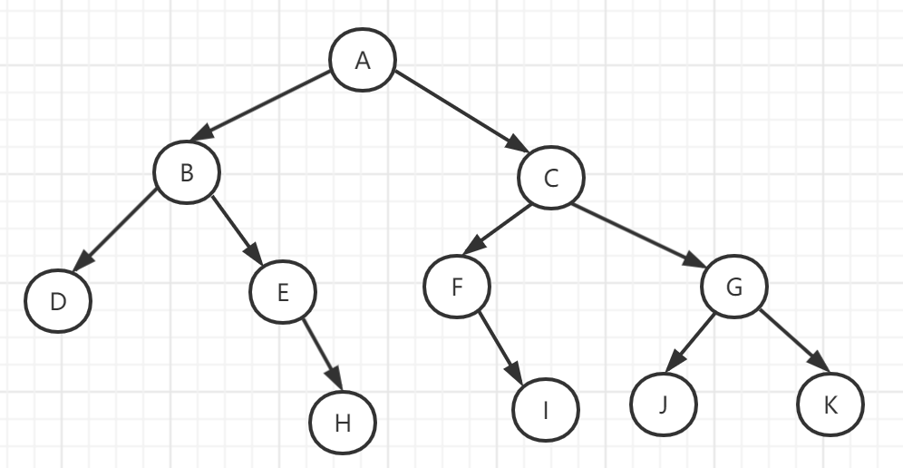

### 集合常见笔面试题

PS：Map广义上也是属于集合，但是不继承/实现Collection接口

1. HashMap的原理

   https://blog.csdn.net/weixin_44460333/article/details/86770169

   https://blog.csdn.net/opt1997/article/details/104783005

   基础：

   &运算：按位与运算，同时都为1才为1，否则为0

   ^运算：异或运算，不同时为0或1，则为1，否则为0

   底层是数组+链表，当数量达到了 `16 * 0.75 = 12` 就需要将当前 16 的容量进行扩容（resize()方法），1.8优化后，当链表数大于8时且数组的容量（`capacity`）大于64，链表变成红黑树。

   put()：

   ​	**key的hashcode**与**key的hashcode的高16** *异或运算* 获得`hash`

   ​    putVal():

   ​	判断数组是否为空，空的话需要初始化(resize())

   ​	 **hash**与 **数组长度-1** 进行*按位与运算* 获得桶下标，如果为null，直接添加节点

   ​	不为null，存在hash冲突，比较桶内的key与新增的key是否相等，相等就赋值给 `e`

   ​	key不相等，则判断当前是否为红黑树，如果是按红黑树的方式写入

   ​	如果是个链表，就需要将当前的 key、value 封装成一个新节点写入到当前桶的后面【尾插法，解决多线程下可能引发的死锁，1.7之前是头插法】（形成链表）。

   ​	接着判断当前链表的大小是否大于预设的阈值，大于时就要转换为红黑树(treeifyBin())。

   ​	如果在遍历过程中找到 key 相同时直接退出遍历。

   ​	如果 `e != null` 就相当于存在相同的 key,那就需要将值覆盖。

   ​	最后判断是否需要进行扩容(resize())。

   ```java
    	//桶的初始化大小，底层是数组，所以这里指的是数组的默认大小=16
   	static final int DEFAULT_INITIAL_CAPACITY = 1 << 4; // aka 16
   	//桶最大值
       static final int MAXIMUM_CAPACITY = 1 << 30;
   	//默认的负载因子
       static final float DEFAULT_LOAD_FACTOR = 0.75f;
   	//将链表转换为红黑树的阈值
       static final int TREEIFY_THRESHOLD = 8;
       //将红黑树转换为链表的阈值
       static final int UNTREEIFY_THRESHOLD = 6;
   	//最小树形化阈值,数组的容量>64时才考虑转化成红黑树
       static final int MIN_TREEIFY_CAPACITY = 64;
   ```

get():

- 首先将 key hash 之后取得所定位的桶。
- 如果桶为空则直接返回 null 。
- 否则判断桶的第一个位置(有可能是链表、红黑树)的 key 是否为查询的 key，是就直接返回 value。
- 如果第一个不匹配，则判断它的下一个是红黑树还是链表。
- 红黑树就按照树的查找方式返回值。
- 不然就按照链表的方式遍历匹配返回值。

问题：并发情况下容易产生死循环？没看懂

2. ConcurrentHashMap的原理

java.util.concurrent包下

1.7ConcurrentHashMap 采用了分段锁技术，其中 Segment 继承于 ReentrantLock(可重入锁)，val 和 next用volatile保证可见性，但是不保证原子性，所以put操作需要加锁 

1.8 采用`CAS + synchronized` 来保证并发安全性

```java
 static class Node<K,V> implements Map.Entry<K,V> {
        final int hash;
        final K key;
        volatile V val;//volatile保证可见性
        volatile Node<K,V> next; 
```

put():

- 根据 key 计算出 hashcode 

  ```java
   int hash = spread(key.hashCode());//hash 值获取
    static final int spread(int h) {
          return (h ^ (h >>> 16)) & HASH_BITS;  //HASH_BITS=0x7fffffff
    }
  ```

- 判断是否需要进行初始化(initTable())

- `f` 即为当前 key 定位出的 Node，如果为空表示当前位置可以写入数据，利用 CAS 尝试写入，失败则自旋保证成功。

- 如果当前位置的 `hashcode == MOVED == -1`,则需要进行扩容(helpTransfer())。

- 如果都不满足，则利用 synchronized 锁写入数据。

- 如果数量大于 `TREEIFY_THRESHOLD` 则要转换为红黑树。

  

get():

- 根据计算出来的 hashcode 寻址，如果就在桶上那么直接返回值。
- 如果是红黑树那就按照树的方式获取值。
- 如不满足就按照链表的方式遍历获取值。

3. HashTable和HashMap的区别

   同：**实现了Map接口**

   不同：

   ①继承

   Hashtable : Dictionary<K,V>

   HashMap : AbstractMap<K,V>

   ②线程安全性

   Hashtable的方法是同步的（synchronized），线程安全的；HashMap不是同步的，不是线程安全的。

   ③键值

   Hashtable中不允许null键或null值，会报空指针异常；HashMap中允许唯一的null键，允许一个或多个的键的值为null

   ④哈希值

   ```java
   int hash = key.hashCode(); //HashTable是直接使用对象的hashCode
   ```

   ```java
    static final int hash(Object key) {//HashMap是重新计算hash值
        int h;
        return (key == null) ? 0 : (h = key.hashCode()) ^ (h >>> 16);
   }
   ```

   ⑤扩容

   Hashtable和HashMap的底层实现的数组初始大小和扩容方式。

   Hashtable初始大小为11，并且每次扩容都为：2*old+1

   HashMap的默认大小为16，并且一 定是2的指数，每次扩容都为old*2

   

4. 线程安全的集合类

   Vector：就比ArrayList多了个同步化机制（synchronized线程安全）。

   Hashtable：就比HashMap多了个线程安全（synchronized）。

   ConcurrentHashMap:是一种高效但是线程安全的集合。

   Stack：栈，也是线程安全的，继承于Vector。

   

5. ArrayList和LinkedList的理解

   ArrayList和LinkedList 都实现了List接口

   ArrayList 的底层数据结构是数组，可以使用索引的方式来快速定位对象的位置，因此对于快速的随机取得对象的需求，使用ArrayList实现执行效率上会比较好. 

   LinkedList的底层数据结构是链表，有自己特定的方法，如: addFirst(),addLast(),getFirst(),removeFirst()等。因此在一定情况下，进行insert和remove动作时在效率上要比ArrayList要好。适合用来实现Stack(堆栈-先进后出)与Queue(队列-先进先出)

   

6. ArrayList和HashMap对空null的处理

   ArrayList允许null值；HashMap中允许唯一的null键，允许一个或多个的键的值为null

   

7. Hashtable线程安全嘛，讲讲线程安全具体实现

   Hashtable中数据进行操作的方法都有synchronized关键字，被synchronized关键字修饰的方法体和代码块一次只能被一个线程执行，也就保证了线程安全的问题。

   

   

8. 树的前序、中序、后序遍历

   **前序遍历：根->左子树->右子树**

   **中序遍历：左子树->根->右子树**

   **后序遍历：左子树->右子树->根**

   

   

   有空的话，可以补null处理，遍历后结果去掉null就好

   前：A B D E H C F I G J K

   中 : D B E H A F  I C J G K  

   后 : D H E B I F J K G C A

   

9. 红黑树

   

   

10. 介绍下双列集合

    双列集合是存储键值映射关系的元素的集合，可通过键可以找到值，键必须是唯一，值可以重复。

    双列集合有：HashMap、Hashtable、ConcurrentHashMap、LinkedHashMap（按插入顺序排序，HashMap+双向链表）、TreeMap

 11.  反转链表

      剑指offer：https://leetcode-cn.com/problems/fan-zhuan-lian-biao-lcof/

      

 12.  数组转List的实现

      Java Guide : https://snailclimb.gitee.io/2019/08/20/java/java%E5%9F%BA%E7%A1%80/Java%E7%96%91%E9%9A%BE%E7%82%B9/#toc-heading-10

      

      

      


